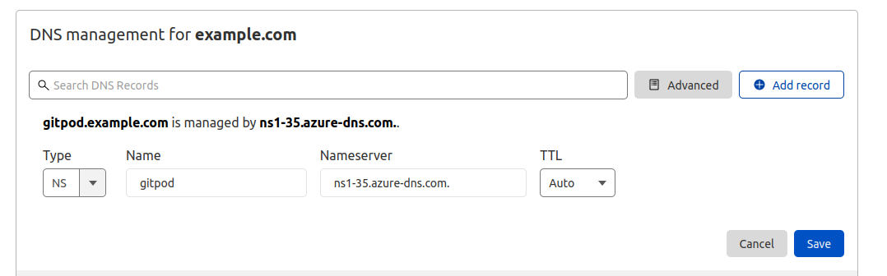

# Running Gitpod in [Azure AKS](https://azure.microsoft.com/en-gb/services/kubernetes-service/)

Before starting the installation process, you need:

- An Azure account
  - [Create one now by clicking here](https://azure.microsoft.com/en-gb/free/)
- A user account with "Owner" IAM rights on the subscription
- A `.env` file with basic details about the environment.
  - We provide an example of such file [here](.env.example).
- [Docker](https://docs.docker.com/engine/install/) installed on your machine, or better, a Gitpod workspace :) 

## Azure authentication

For simplicity, this guide does **not** use an Azure [service principal](https://docs.microsoft.com/en-us/azure/active-directory/develop/howto-create-service-principal-portal).
Authentication is done via an interactive URL, similar to this:

```shell
To sign in, use a web browser to open the page https://microsoft.com/devicelogin and enter the code ABC123DEF to authenticate.
```

**To start the installation, execute:**

```shell
make install
```

The whole process takes around twenty minutes. In the end, the following resources are created:

- an AKS cluster running Kubernetes v1.21.
- Azure load balancer.
- Azure MySQL database.
- Azure Blob Storage.
- Azure DNS zone.
- Azure container registry.
- [calico](https://docs.projectcalico.org) as CNI and NetworkPolicy implementation.
- [cert-manager](https://cert-manager.io/) for self-signed SSL certificates.
- [Jaeger operator](https://github.com/jaegertracing/helm-charts/tree/main/charts/jaeger-operator) - and Jaeger deployment for Gitpod distributed tracing.
- [gitpod.io](https://github.com/gitpod-io/gitpod) deployment.

## DNS records

> This setup will work even if the parent domain is not owned by a DNS zone in the Azure portal.

The recommended setup is to have `SETUP_MANAGED_DNS` to be `true` which will create an
[Azure DNS zone](https://docs.microsoft.com/en-us/azure/dns/dns-zones-records) for your
domain. When the zone is created, you will see various nameserver records (with type `NS`), such
as `ns1-xx.azure-dns.com`, `ns2-xx.azure-dns.net`, `ns3-xx.azure-dns.org` and `ns4-xx.azure-dns.info`
(where `xx` is the number randomly assigned by Azure).

In the DNS manager for the parent domain (eg, `example.com`), create a nameserver record for
each of the nameservers generated by Azure under the subdomain used (eg, `gitpod.example.com`).
This is what it would look like if your parent domain was using Cloudflare.



Once applied, please allow a few minutes to for DNS propagation.

### Common errors running make install

- Insufficient regional quota to satisfy request

  Depending on the size of the configured `disks size` and `machine-type`,
  it may be necessary to request an [increase in the service quota](https://docs.microsoft.com/en-us/azure/azure-resource-manager/management/azure-subscription-service-limits)

  *After increasing the quota, retry the installation running `make install`*

- Some pods never start (`Init` state)

  ```shell
  kubectl get pods -l component=proxy
  NAME                     READY   STATUS    RESTARTS   AGE
  proxy-5998488f4c-t8vkh   0/1     Init 0/1  0          5m
  ```

  The most likely reason is because the [DNS01 challenge](https://cert-manager.io/docs/configuration/acme/dns01/) has yet to resolve. If using `SETUP_MANAGED_DNS`, you will need to update your DNS records to point to the Azure DNS zone nameserver.

  Once the DNS record has been updated, you will need to delete all Cert Manager pods to retrigger the certificate request

  ```shell
  kubectl delete pods -n cert-manager --all
  ```

  After a few minutes, you should see the `https-certificate` become ready.

  ```shell
  kubectl get certificate
  NAME                        READY   SECRET                      AGE
  https-certificates          True    https-certificates          5m
  ```

## Verify the installation

First, check that Gitpod components are running.

```shell
kubectl get pods
NAME                                      READY   STATUS    RESTARTS   AGE
agent-smith-c9v58                         2/2     Running   0          7m35s
agent-smith-j7b85                         2/2     Running   0          7m35s
agent-smith-mwf5d                         2/2     Running   0          7m35s
blobserve-84f895c88c-476m2                2/2     Running   0          7m33s
content-service-57c7fdb84d-dl49k          1/1     Running   0          7m34s
dashboard-b79d84d47-z7hzg                 1/1     Running   0          7m34s
image-builder-mk3-5ff7c68bb4-qqbw5        2/2     Running   0          7m34s
jaeger-operator-777d987c8b-ts9gw          1/1     Running   0          7m33s
messagebus-0                              1/1     Running   0          7m34s
minio-697975c744-swwp6                    1/1     Running   0          7m34s
minio-697975c744-tj96r                    1/1     Running   0          7m34s
openvsx-proxy-0                           1/1     Running   0          7m34s
proxy-c58846cf5-cbdgb                     2/2     Running   0          7m33s
registry-facade-84sgf                     2/2     Running   0          7m34s
registry-facade-n6kc9                     2/2     Running   0          7m35s
registry-facade-zt7qt                     2/2     Running   0          7m34s
server-689b886647-dkd5h                   2/2     Running   0          7m34s
ws-48fe6d74-6e6d-4e3e-a6a4-1bf160b4ed3d   1/1     Running   0          2m43s
ws-daemon-v8284                           2/2     Running   0          7m35s
ws-daemon-vs59b                           2/2     Running   0          7m35s
ws-daemon-w6gmj                           2/2     Running   0          7m35s
ws-manager-54c8f9995f-lrrkx               1/1     Running   0          7m34s
ws-manager-bridge-8648cd6b69-nqxnh        2/2     Running   0          7m34s
ws-proxy-574f9dcbcc-qrn5m                 1/1     Running   0          7m33s
ws-scheduler-84d99cbbbb-5p86k             2/2     Running   0          7m34s
```

### Test Gitpod workspaces

When the provisioning and configuration of the cluster is done, the script shows the URL of the load balancer,
like:

Please open the URL `https://<domain>/workspaces`.
It should display the Gitpod login page similar to the next image.

*DNS propagation* can take several minutes.


----

## Destroy the cluster and Azure resources

Remove the Azure cluster running:

```shell
make uninstall
```

> The command asks for a confirmation:
> `Are you sure you want to delete: Gitpod (y/n)?`

This will destroy the Kubernetes cluster and allow you to manually delete the cloud storage.
